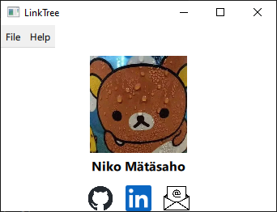

# LinkTree

    

A simple project of a "virtual business card". Made mainly as a Proof of Concept project utilizing C++ and Qt with QML.

I have some plans on improving this project which I may or may not implement in the future.

# Requirements

**Qt6 is required**

This project *should* be cross-platform, as no platform specific components have been used as far as I know.

### Compiling

To compile in Qt Creator, just clone the repository and open `CMakeLists.txt` in the editor and then build the project. Source and required files are configured to be included automatically.

# Configuration

`config` file in the repository root directory is embedded to the application executable, and can be used to configure information shown in the main window. The field names should be pretty self-explanatory. All fields support UTF-8 encoded text.

# License

Copyright (C) Niko Mätäsaho 2023

This project is licensed under LGPLv3. For full license see [LICENSE](LICENSE).
